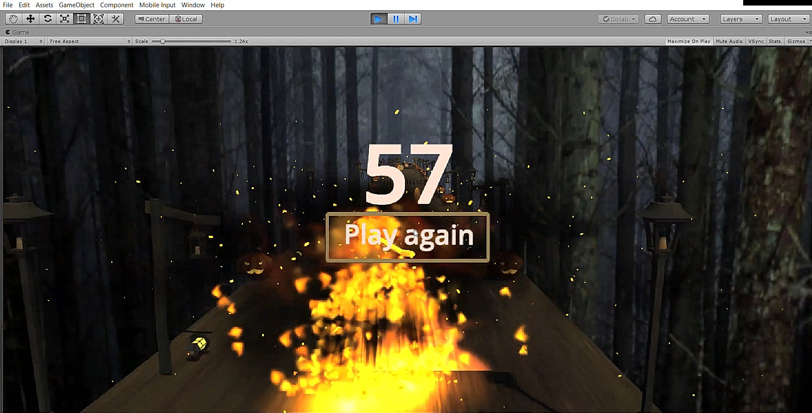
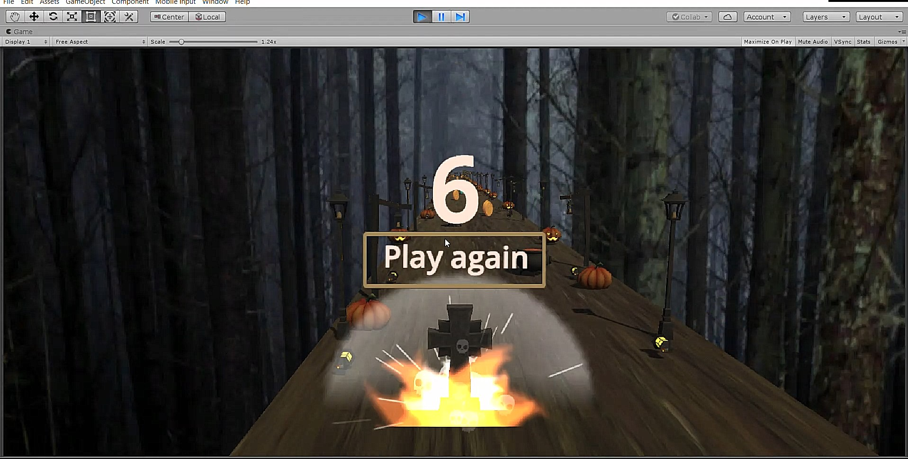

# Banshee Game(InfiniteRunner Game) In Unity 3D:

This is a 3D(Infinite Runner Game) with Halloween theme created in Unity in which player has to run
on an infinite platform 
and avoid collision enemy objects and score is increasing by collecting coins.
We have play again button and a starting menu also,
By making this project my knowledge is enhance in SFX,Particle system,Animator setup,Enemy spawner,
Physics in game,Animation,Basic UI,Game manager,
Maps,Assets,3d model,C# scripts,Gameplay,Sceneview,Camera,Audios,Lighting etc.

Screenshots
-----------

